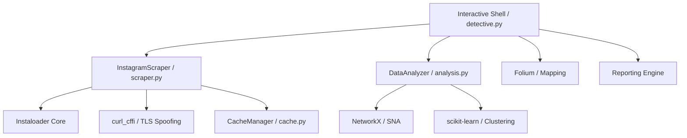

# IG-Detective: Technical Documentation & Manual 🕵️‍♂️📑

**Version**: 2.0.0 (Bleeding-Edge Edition)  
**Author**: [@shredzwho](https://github.com/shredzwho)

---

## 1. Introduction

**IG-Detective** is an advanced Open Source Intelligence (OSINT) framework designed for forensic investigation of Instagram profiles. Beyond simple data scraping, it integrates social network theory, temporal activity analysis, and geospatial intelligence to build a comprehensive picture of a target's digital footprint and physical-world associations.

---

## 2. System Architecture

The project follows a modular, decoupled architecture to ensure scalability and ease of integration for new forensic models.

---

## 3. Core Modules

### 3.1. Interactive Shell (`detective.py`)
The primary interface. It manages:
- **Session Persistence**: Securely handles login and session file management.
- **Command Dispatch**: Routes user input to the appropriate scraper or analysis logic.
- **Reporting**: Automatically serializes every command's output into `data/<target>/` as both structured JSON and human-readable TXT.

### 3.2. Advanced Scraper (`scraper.py`)
The "Networking Layer". It handles all communication with Instagram's private API.
- **Evasion Logic**: Injects spoofed TLS fingerprints and randomized jitter.
- **Data Hydration**: Converts raw API responses into clean Python dataclasses.
- **Contact Extraction**: Dedicated logic for scanning business accounts for emails and phone numbers.

### 3.3. Forensic Analysis (`analysis.py`)
The "Brain" of the tool. It performs heavy computational tasks on gathered data.
- **SNA**: Calculates relationship weights between users.
- **Clustering**: Identifies patterns in high-dimensional temporal data.

### 3.4. Cache Management (`cache.py`)
A TTL-based object caching system that prevents redundant network requests, speeding up investigations and reducing the risk of rate-limiting.

---

## 4. Advanced Evasion Techniques

### 4.1. TLS Fingerprint Spoofing
Traditional scraping tools use standard libraries (like `requests`) that have distinct TLS signatures easily flagged by Cloudflare and Instagram's Akamai CDN.
IG-Detective uses **`curl_cffi`** to impersonate a modern Chrome browser. This includes:
- **JA3 Fingerprint Alignment**: Matching the TLS handshake patterns of a real browser.
- **HTTP/2 Support**: Mimicking the multiplexing behavior of actual user traffic.

### 4.2. Poisson Jitter Logic
Static or uniformly random delays (e.g., `random.uniform(5, 10)`) are detectable by sophisticated bot-detection algorithms.
We implement **Poisson Distribution** delays. This model creates a "long-tail" delay pattern, mimicking human browsing where a user may browse quickly for a moment and then pause for a naturally variable duration.

---

## 5. Analytical Methodologies

### 5.1. Social Network Analysis (SNA)
Using the `sna` command, the tool constructs a graph where:
- **Nodes**: Represent Instagram users.
- **Edges**: Represent interactions (comments, tags).
- **Weights**: Comments count as 1, while a Tag counts as 5 (higher significance).
**Algorithm**: We use **Degree Centrality** to identify the "Inner Circle"—the users most central to the target's social graph.

### 5.2. Temporal Behavior Modeling
The `temporal` command analyzes the UTC timestamps of all posts and stories.
- **Activity Troughs**: Identified using **DBSCAN clustering**.
- **Sleep Gap**: The longest continuous window of zero activity is assumed to be the target's sleep cycle.
- **Time Zone Prediction**: By assuming sleep occurs roughly between 12 AM and 8 AM local time, the tool calculates the offset from UTC to predict the target's actual location.

---

## 6. Geospatial Intelligence

The `addrs` command performs a two-stage geospatial verification:
1. **Extraction**: Collects exact GPS coordinates (Lat/Long) from post metadata.
2. **Reverse Geocoding**: Queries the `Nominatim` (OSM) API to resolve coordinates into physical addresses.
3. **Visualization**: Generates a **Folium Interactive Map**. This map is exported as an HTML file with pins that contain post timestamps and resolved address names.

---

## 7. Reporting & Data Structure

Investigations are stored in `data/<target_username>/`.
- **`info.json`**: Base profile snapshot.
- **`sna_inner_circle.json`**: Weighted relationship data.
- **`temporal_analysis.json`**: Sleep patterns and TZ predictions.
- **`interactive_map.html`**: A standalone browser-viewable map.
- **`*_contact.csv`**: Scanned email and phone lead lists.

---

## 8. Development & Maintenance

### Adding New Commands
1. Define the logic in `analysis.py` (for data processing) or `scraper.py` (for network fetching).
2. Add a `do_<command>` method to the `InteractiveShell` class in `detective.py`.
3. Ensure you use `self._save_report()` to maintain investigation records.

---

## 9. Security & Best Practices

- **Use a Burner Account**: Never use your primary account for deep-scan operations.
- **Rate Limit Respect**: Even with evasion, high-frequency scraping can trigger manual review. Use the `batch` command with reasonable targets.
- **Data Privacy**: The generated `data/` folder contains sensitive OSINT information. Ensure it remains git-ignored and handled according to your local privacy laws.

---
*Documentation built for the IG-Detective Community.*
