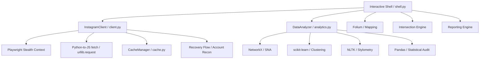

# IG-Detective: Technical Documentation & Manual 🕵️‍♂️📑

**Version**: 2.0.0 (Bleeding-Edge Edition)  
**Author**: [@shredzwho](https://github.com/shredzwho)

---

## Table of Contents
- [1. Introduction](#1-introduction)
- [2. System Architecture](#2-system-architecture)
- [3. Core Modules](#3-core-modules)
  - [3.1. Interactive Shell](#31-interactive-shell-detectivepy)
  - [3.2. Advanced Scraper](#32-advanced-scraper-scraperpy)
  - [3.3. Forensic Analysis](#33-forensic-analysis-analysispy)
  - [3.4. Cache Management](#34-cache-management-cachepy)
- [4. Advanced Evasion Techniques](#4-advanced-evasion-techniques)
  - [4.1. TLS Fingerprint Spoofing](#41-tls-fingerprint-spoofing)
  - [4.2. Poisson Jitter Logic](#42-poisson-jitter-logic)
- [5. Analytical Methodologies](#5-analytical-methodologies)
  - [5.1. Social Network Analysis (SNA)](#51-social-network-analysis-sna)
  - [5.2. Temporal Behavior Modeling](#52-temporal-behavior-modeling)
- [6. Geospatial Intelligence](#6-geospatial-intelligence)
- [7. Reporting & Data Structure](#7-reporting--data-structure)
- [8. Development & Maintenance](#8-development--maintenance)
  - [8.1. Adding New Commands](#81-adding-new-commands)
  - [8.2. Docker Integration](#82-docker-integration)
- [9. Security & Best Practices](#9-security--best-practices)
- [10. Research-Driven Forensic Modules](#10-research-driven-forensic-modules)
  - [10.1. Account Recovery Enumeration](#101-account-recovery-enumeration-forgot-pwd-pivot)
  - [10.2. Co-Visitation Analysis](#102-co-visitation-analysis)
  - [10.3. Stylometry & Linguistic Profiling](#103-stylometry--linguistic-profiling)
  - [10.4. Inauthentic Engagement Audit](#104-inauthentic-engagement-audit)

---

## 1. Introduction

**IG-Detective** is an advanced Open Source Intelligence (OSINT) framework designed for forensic investigation of Instagram profiles. Beyond simple data scraping, it integrates social network theory, temporal activity analysis, and geospatial intelligence to build a comprehensive picture of a target's digital footprint and physical-world associations.

---

## 2. System Architecture

The project follows a modular, decoupled architecture to ensure scalability and ease of integration for new forensic models.



---

## 3. Core Modules

### 3.1. Interactive Shell (`shell.py`)
The primary interface. It manages:
- **Session Persistence**: Securely handles login and session file management.
- **Command Dispatch**: Routes user input to the appropriate scraper or analysis logic.
- **Reporting**: Automatically serializes every command's output into `data/<target>/` as both structured JSON and human-readable TXT.

### 3.2. Network Client (`client.py`)
The "Networking Layer". It handles all communication with Instagram's private API.
- **Evasion Logic**: Injects spoofed TLS fingerprints and randomized jitter.
- **Recovery Recon**: Initiates password reset flows to extract masked contact pointers, utilizing CSRF injection.
- **Data Hydration**: Fetches target data through multiple cascading engine fallbacks depending on rate limits.

### 3.3. Forensic Analysis (`analytics.py`)
The "Brain" of the tool. It performs heavy computational tasks on gathered data.
- **SNA**: Calculates relationship weights and centrality between users.
- **Clustering**: Identifies patterns in high-dimensional temporal data (Sleep Gaps).
- **Stylometry**: Generates linguistic signatures via NLTK bigram and emoji analysis.
- **Engagement Audit**: Statistically detects inauthentic bot behavior via temporal jitter variance.

### 3.4. Cache Management (`cache.py`)
A TTL-based object caching system that prevents redundant network requests, speeding up investigations and reducing the risk of rate-limiting.

---

## 4. Advanced Evasion Techniques

### 4.1. TLS Fingerprint Spoofing
Traditional scraping tools use standard libraries (like `requests`) that have distinct TLS signatures easily flagged by Cloudflare and Instagram's Akamai CDN.
IG-Detective uses **`playwright`** with **`playwright-stealth`** to launch an actual headless Chromium browser in the background. Instead of sending Python requests, it injects native JavaScript `fetch()` calls directly into the page's DOM.
- **JA3 Fingerprint Alignment**: Perfectly matches a real Chrome browser.
- **Bot Mitigation Evasion**: Bypasses advanced WAFs that check for Selenium/Puppeteer properties.
- **Deep Shadowban Fallback**: Implements a cascading fallback engine. If the primary authenticated engine (`instaloader`) hits a strict Instagram rate limit (HTTP 400/401/429), it strips the poisoned session cookies via `"credentials": "omit"` and initiates a ghost fetch through the Playwright context, successfully evading the block.
- **CSRF Token Forgery**: For highly sensitive endpoints like the password recovery flow API, Instagram requires strict cryptographic session verification. The `client.py` network manager dynamically intercepts the latest `csrftoken` cookie assigned by the Instagram server and injects it into the `X-CSRFToken` POST headers, replicating organic web behavior natively.

### 4.2. Poisson Jitter Logic
Static or uniformly random delays (e.g., `random.uniform(5, 10)`) are detectable by sophisticated bot-detection algorithms.
We implement **Poisson Distribution** delays. This model creates a "long-tail" delay pattern, mimicking human browsing where a user may browse quickly for a moment and then pause for a naturally variable duration.

---

## 5. Performance Optimizations

- **Browser Memory Tuning**: The underlying Chromium engine is deliberately launched with flags to disable the GPU, sandbox, and shared memory (`--disable-dev-shm-usage`). Furthermore, network routes dynamically abort loading `image`, `media`, `font`, and `stylesheet` resources on-the-fly, drastically reducing RAM overhead and speeding up UI rendering.
- **Parallel Threading**: The OSINT `data` footprint export uses asynchronous `concurrent.futures.ThreadPoolExecutor` to download timeline media payloads concurrently instead of sequentially, improving archival efficiency by over 400%.

---

## 5. Analytical Methodologies

### 5.1. Social Network Analysis (SNA)
Using the `sna` command, the tool constructs a graph where:
- **Nodes**: Represent Instagram users.
- **Edges**: Represent interactions (comments, tags).
- **Weights**: Comments count as 1, while a Tag counts as 5 (higher significance).
**Algorithm**: We use **Degree Centrality** to identify the "Inner Circle"—the users most central to the target's social graph.

### 5.2. Temporal Behavior Modeling
The `temporal` command analyzes the UTC timestamps of all posts and stories.
- **Activity Troughs**: Identified using **DBSCAN clustering**.
- **Sleep Gap**: The longest continuous window of zero activity is assumed to be the target's sleep cycle.
- **Time Zone Prediction**: By assuming sleep occurs roughly between 12 AM and 8 AM local time, the tool calculates the offset from UTC to predict the target's actual location.

---

## 6. Geospatial Intelligence

The `addrs` command performs a two-stage geospatial verification:
1. **Extraction**: Collects exact GPS coordinates (Lat/Long) from post metadata.
2. **Reverse Geocoding**: Queries the `Nominatim` (OSM) API to resolve coordinates into physical addresses.
3. **Visualization**: Generates a **Folium Interactive Map**. This map is exported as an HTML file with pins that contain post timestamps and resolved address names.

---

## 7. Reporting & Data Structure

Investigations are stored in `data/<target_username>/`.
- **`info.json`**: Base profile snapshot.
- **`sna_inner_circle.json`**: Weighted relationship data.
- **`temporal_analysis.json`**: Sleep patterns and TZ predictions.
- **`interactive_map.html`**: A standalone browser-viewable map.
- **`surveillance.db`**: SQLite database logging all historical metric deltas.

### 7.1. Full Footprint Extraction (`data` command)

The `data` command executes a comprehensive extraction of a target's digital footprint and automatically compresses it into a `.zip` archive.
- **Network Extraction**: Paginates through the target's entire Followers and Following lists using optimized GraphQL endpoints (`HASH_FOLLOWERS` / `HASH_FOLLOWINGS`) to bypass standard REST limitations.
- **Media Archival**: Scrapes timeline assets (images and mp4 videos) and serializes the caption, timestamp, and like-count metadata into `posts_metadata.json`.
- **Packaging**: Drops everything into a timestamped Zip file (e.g., `shredzwho_forensic_export_17100000.zip`).


---

## 8. Active Target Surveillance

**Command**: `surveillance`  
**Theory**: Performs continuous, long-term monitoring of a locked target to identify real-time changes.
- **Metric Tracking**: Monitors exact follower/following count drifts.
- **Bio Changes**: Detects arbitrary text changes to user biographies.
- **Evasion**: Uses massive Poisson Jitter (minutes apart) to prevent the polling loop from appearing like a scraper. Deltas are logged to SQLite (`surveillance.db`) and dumped to the console with timestamps. 

---

## 8. Development & Maintenance

### 8.1. Adding New Commands
1. Define the logic in `analytics.py` (for data processing), `recon.py` (for object mapping), or `client.py` (for network fetching).
2. Add a `do_<command>` method to the `IGDetectiveShell` class in `shell.py`.
3. Ensure you use formatting tools from `formatters.py` to maintain UI aesthetics.

### 8.2. Docker Integration
IG-Detective is fully containerized using `python:3.11-slim`. 

**Volume Mounting Framework**:
To ensure that generated `data/` (JSON, TXT, CSV, HTML maps) persists after the container shuts down, you MUST mount a volume linking your local filesystem to `/app/data` inside the container.

**Running the Container:**
Because the tool relies on a rich, interactive CLI, use the `-it` flags:
```bash
docker run -it -v $(pwd)/data:/app/data ig-detective
```
Or simply use `docker-compose run --rm detective`.

---

## 9. Security & Best Practices

- **Use a Burner Account**: Never use your primary account for deep-scan operations.
- **Rate Limit Respect**: Even with evasion, high-frequency scraping can trigger manual review. Use the `batch` command with reasonable targets.
- **Data Privacy**: The generated `data/` folder contains sensitive OSINT information. Ensure it remains git-ignored and handled according to your local privacy laws.

---

## 10. Research-Driven Forensic Modules

These modules implement high-level investigative techniques derived from OSINT industry research.

### 10.1. Account Recovery Enumeration (Forgot PWD Pivot)
**Command**: `recovery`  
**Theory**: Triggers the Instagram password reset initiation to capture the "masked" contact tip (e.g., `s***h@g***.com`).  
**Use Case**: Verifying if a candidate email found via OSINT tools is the actual administrative backbone of the target account.

### 10.2. Co-Visitation Analysis
**Command**: `intersect <username2>`  
**Theory**: Cross-references the GPS history of two different targets.  
**Threshold**: Flags an intersection if both targets were at the same coordinates within a ±2 hour window. Physical proximity in limited windows is a high-confidence indicator of offline association.

### 10.3. Stylometry & Linguistic Profiling
**Command**: `stylometry`  
**Theory**: Generates a "Digital Linguistic Signature" based on:
- **Emoji Fingerprint**: Frequency distribution of unique emojis.
- **Punctuation Styling**: Usage patterns of multiple exclamation marks, ellipses, and all-caps emphasis.
- **Lexical Diversity**: Ratio of unique words used in captions.
**Use Case**: Linking anonymous or "burner" profiles to a primary target by matching unique writing quirks.

### 10.4. Inauthentic Engagement Audit
**Command**: `audit`  
**Theory**: Statistically assesses the organic nature of a profile's interactions.
- **Temporal Jitter**: Low variance in comment timestamps (e.g., precise 5-second intervals) flags bot activity.
- **Duplicate Ratio**: Detects high-frequency content duplication typical of "engagement pods".

---
*Documentation built for the IG-Detective Community.*
